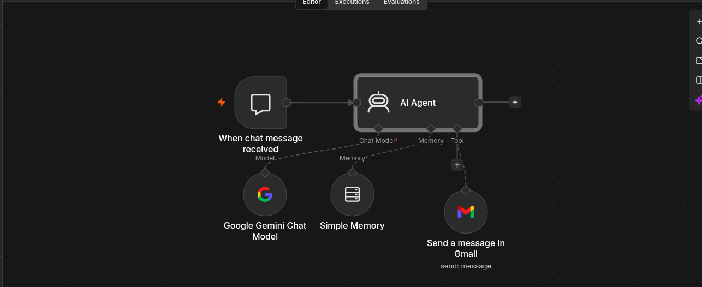
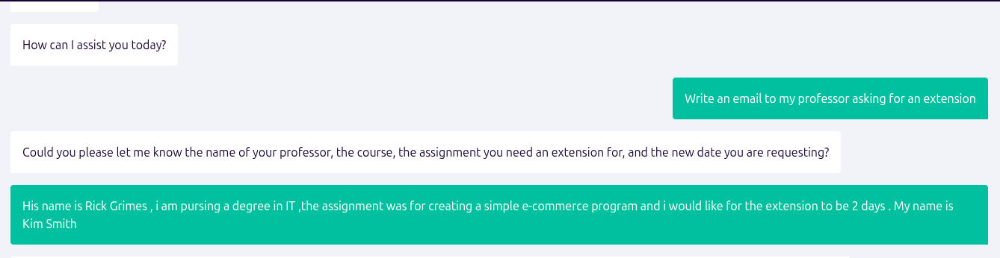
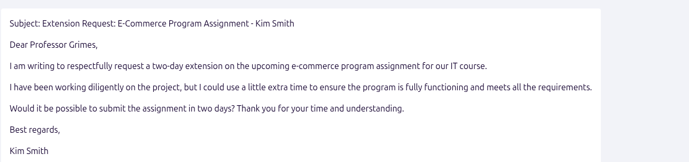

# n8n AI Automation Journey

A public log of how I'm learning AI workflow automation with [n8n](https://n8n.io): what I've built, what broke, and what I learned along the way.

## About me

I'm an IT student focusing on networking and cybersecurity, working toward a career as a network engineer. I'm learning n8n to get hands-on with APIs, webhooks, and automation. These skills carry over to network automation and security operations work.

## My setup

- **n8n Community Edition**, self-hosted with Docker on Ubuntu (free, unlimited executions)
- **AI model:** Google Gemini via the free AI Studio tier
- **Email:** Gmail through OAuth2 (own Google Cloud project, test mode)

```bash
docker volume create n8n_data
docker run -d --restart unless-stopped --name n8n -p 5678:5678 \
  -v n8n_data:/home/node/.n8n \
  docker.n8n.io/n8nio/n8n
```

Then open `http://localhost:5678`.

## Projects

| # | Project | What it does | Status |
|---|---------|--------------|--------|
| 1 | [Simple email agent](workflows/simple-email-agent.json) | Chat agent that drafts professional emails, with a Gmail send tool attached | Done |
| 2 | Inbox Manager Agent | Reads, classifies, and labels emails, then drafts, replies, or notifies | In progress |
| 3 | Network alert workflow | Check whether devices respond and send an alert when one doesn't | Planned |

## Project 1: Simple email agent



**Nodes:** Chat Trigger, AI Agent, Google Gemini Chat Model, Simple Memory, Gmail tool.

The agent asks one clarifying question when details are missing, then writes the email:




### System prompt

```text
You are an expert email writer. Your job is to craft professional, clear, and effective emails based on the user's instructions.

 Guidelines:

1. Tone: Match the tone the user requests. If not specified, default to professional and friendly.
2. Structure:
   - Subject line (concise, specific)
   - Greeting (appropriate to the relationship)
   - Body (clear, concise, one idea per paragraph)
   - Call to action (if applicable)
   - Sign-off
3. Length: Keep it as short as possible while still being complete. No fluff.
4. Clarity: Use simple language. Avoid jargon unless the user's context requires it.
5. Empathy: Acknowledge the recipient's perspective where relevant.

Rules:
- If the user doesn't specify a recipient, use a generic greeting.
- If key details are missing (recipient name, purpose, tone), ask ONE clarifying question before writing.
- Never make up facts, dates, or details the user didn't provide.
- If the user gives you raw notes or bullet points, organize them into a polished email.
- Output ONLY the final email (subject + body). No explanations or commentary.
```

**Design choices:** one clarifying question at most, no invented facts, and output limited to the final email.

### Known limitations

- The prompt says to output only the email, so the agent drafts but doesn't send. The Gmail tool is attached, but the prompt never says when to use it.
- Planned fix: only send when the user gives a recipient address and explicitly asks to send.

### Import it

1. In n8n, create a new workflow, then **⋯ → Import from file** and choose `workflows/simple-email-agent.json`.
2. Select your own Gemini and Gmail credentials when prompted. Credential IDs in this file are placeholders.

## Concepts I've learned

- **APIs and HTTP:** requests, responses, methods, status codes, JSON
- **Webhooks:** test URL vs production URL, and why a workflow must be published
- **OAuth2:** Client ID, Client Secret, scopes, tokens, and redirect URLs
- **AI agents:** chat model, memory, tools, and system prompts
- **Self-hosting:** Docker volumes, container restarts, keeping data between runs

## Troubleshooting notes

| Problem | Cause | Fix |
|---------|-------|-----|
| `sss_cache` message after `usermod` | SSSD isn't configured; harmless | Ignore it, then confirm with `getent group docker` |
| Gemini `503` high demand | Preview model overloaded | Switch to a stable Flash model; enable Retry On Fail |
| Webhook `404 ... is not registered` | Production URL used on an unpublished workflow | Publish the workflow, or test with **Open chat** in the editor |
| Google Cloud `OR_BACR2_59` | Billing account setup failed | Skip billing and create the project directly; the Gmail API doesn't need it |
| OAuth `invalid_client` | Client Secret typed incorrectly | Copy and paste the secret instead of retyping it |

## Resources I'm learning from

- Nate Herk: *From Zero to Inbox Agent (Full Beginner's Course, No-Code)*
- freeCodeCamp: *n8n Tutorial – Zero to Hero Course*
- [n8n documentation](https://docs.n8n.io)

## Roadmap

- [x] Install n8n with Docker
- [x] Connect Gemini and Gmail credentials
- [x] Build and publish a first AI agent
- [ ] Finish the Inbox Manager Agent
- [ ] Add a knowledge base (embeddings and a vector store)
- [ ] Build a Telegram bot
- [ ] Build a network-monitoring alert workflow
- [ ] Learn Python for deeper network automation

See [learning-log.md](learning-log.md) for the day-by-day notes.

## Security note

Workflow exports here have been sanitized: no API keys, OAuth secrets, instance IDs, or personal email addresses. Never commit credentials or your `n8n_data` volume.
